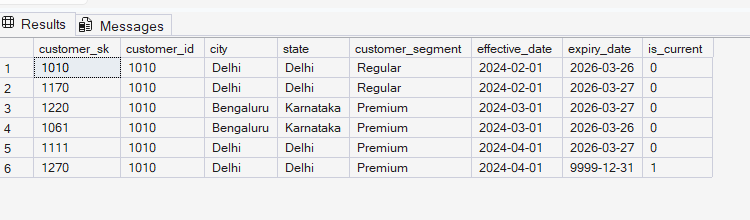
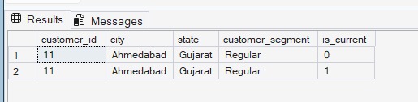
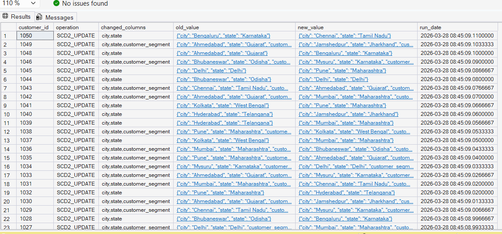
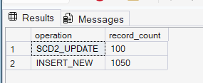
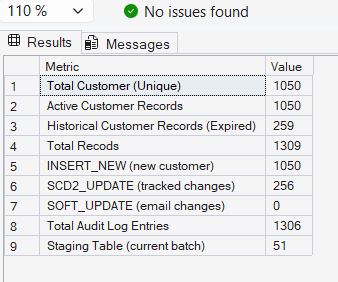

# SCD Type 2 — Customer Dimension Pipeline
**Tech Stack:** Python 3.11 | SQL Server 2019 | pyodbc | Pandas

---

## What is SCD Type 2?

In data warehousing, a Slowly Changing Dimension Type 2 (SCD2) pipeline
preserves the full history of changes in a dimension table. Instead of
overwriting old records when data changes, it expires the old row and
inserts a new one - so we can always answer "what did this record look
like at any point in the past?"

**Example:** If customer 5 moved from Delhi to Mumbai in February 2024,
the dimension table stores BOTH rows - Delhi (expired) and Mumbai (active).
This lets us answer: *"Where did customer 5 live when they placed their January order?"*

---

## Architecture

```
CSV Source Files
      │
      ▼
load_to_staging()     ← TRUNCATE → rename columns → INSERT
      │
      ▼
stg_customer          ← temporary staging table (wiped every run)
      │
      ├──────────────────────────┐
      ▼                          ▼
get_current_dimension()    get_staging_data()
(active dim records)       (incoming batch)
      │                          │
      └──────────┬───────────────┘
                 ▼
          detect_changes()
                 │
    ┌────────────┼──────────────┬──────────────┐
    ▼            ▼              ▼               ▼
  NEW       SCD2_CHANGE    SOFT_UPDATE     NO_CHANGE
(INSERT)  (EXPIRE+INSERT)  (UPDATE only)    (skip)
    │            │              │
    └────────────┴──────────────┘
                 ▼
          apply_scd2()
                 │
      ┌──────────┴──────────┐
      ▼                     ▼
dim_customer          scd_audit_log
(history preserved)   (every change logged)
```

---

## SQL Objects Created

| Object | Type | Purpose |
|---|---|---|
| `dim_customer` | Table | SCD2 dimension — stores all historical versions |
| `stg_customer` | Table | Staging — temporary landing zone per run |
| `scd_audit_log` | Table | Audit trail — logs every insert/expire/update |
| `ix_dim_customer_id` | Index | Fast lookup by customer_id |
| `ix_dim_customer_current` | Index | Fast lookup of active records |

---

## Key Concepts Demonstrated

- **SCD Type 2 dual-operation logic** — expire old row + insert new row
- **Point-in-time queries** — query customer state on any historical date
- **Staging layer pattern** — TRUNCATE → LOAD → VALIDATE → PROCESS
- **Audit logging** — every pipeline operation tracked with old/new values
- **Change classification** — NEW / SCD2_CHANGE / SOFT_UPDATE / NO_CHANGE
- **Surrogate key vs natural key** — customer_sk (never changes) vs customer_id

---

## Project Structure

```
scd-type2-pipeline/
│
├── data/
│   ├── initial_load.csv       ← 1000 customers, Jan 2024
│   ├── delta_load_1.csv       ← Feb 2024 changes (~15% changed)
│   ├── delta_load_2.csv       ← Mar 2024 changes
│   └── delta_load_3.csv       ← Apr 2024 changes
│
├── sql/
│   ├── SQL_SetUp_SCD.sql ← full schema setup
│   └── SCD_Query.sql
│
├── screenshots/
│   ├── 01_customer_history.png
│   ├── 02_point_in_time_query.png
│   ├── 03_audit_log.png
│   └── 04_pipeline_summary.png
│
├── logs/
│   └── scd2_run.log
│
├── generate_data.py           ← generates all 4 CSV files
├── scd_process.py             ← main SCD2 ETL pipeline
├── query_dim.py               ← query functions for dim_customer
├── requirements.txt
├── migration_issues_log.md    ← real bugs hit + fixes applied
└── README.md
```

---

## How to Run

**1. Install dependencies**
```bash
pip install pandas pyodbc faker sqlalchemy
```

**2. Set up SQL Server database**
```bash
# Open SSMS and run:
sql/SQL_SetUp_SCD.sql
```

**3. Generate sample data**
```bash
python generate_data.py
```

**4. Run the SCD2 pipeline**
```bash
# Processes all 4 files in sequence
python scd_process.py
```

**5. Query the results**
```bash
python query_dim.py
```

---

## Screenshots

### Customer Version History (SCD2 proof)

*One customer with multiple rows — each version has effective/expiry dates*

### Point-in-Time Query

*Query showing customer state on a specific historical date*

### Audit Log

*Every pipeline operation logged with old and new values*

### Pipeline Summary


*Record counts — active vs historical rows, operations performed*

---

## Sample Pipeline Output

```
2026-03-27 16:49:01 | INFO | SCD2 Pipeline Started
2026-03-27 16:49:01 | INFO | Source file: data/initial_load.csv
2026-03-27 16:49:01 | INFO | Loaded 200 records into staging
2026-03-27 16:49:02 | INFO | Current dimension: 0 active records
2026-03-27 16:49:02 | INFO | Change Detection → NEW: 200 | SCD2: 0 | SOFT: 0 | NO CHANGE: 0
2026-03-27 16:49:03 | INFO | Applied → Inserted: 200 | Expired: 0 | Soft Updated: 0
2026-03-27 16:49:03 | INFO | Pipeline completed successfully ✓

2026-03-27 16:49:03 | INFO | Source file: data/delta_load_1.csv
2026-03-27 16:49:04 | INFO | Loaded 40 records into staging
2026-03-27 16:49:04 | INFO | Change Detection → NEW: 10 | SCD2: 30 | SOFT: 0 | NO CHANGE: 0
2026-03-27 16:49:05 | INFO | Applied → Inserted: 40 | Expired: 30 | Soft Updated: 0
2026-03-27 16:49:05 | INFO | Pipeline completed successfully ✓
```

---

## Challenges & Solutions

See [migration_issues_log.md](migration_issues_log.md) for detailed
documentation of all 5 real bugs hit during development, their root
causes, and fixes applied.

---

## Interview Q&A

**Q: What is SCD Type 2 and why use it?**  
SCD Type 2 preserves historical records when dimension data changes.
Instead of overwriting, we expire the old row (set expiry_date and
is_current=0) and insert a new row with today as effective_date. This
enables point-in-time reporting — essential for accurate historical analysis.

**Q: How do you identify what changed?**  
I compare the incoming staging data against currently active dimension
records using Pandas. Tracked columns (city, state, segment) trigger a
full SCD2 update. Non-tracked columns (email) do a soft in-place update
with no new history row.

**Q: What's the difference between surrogate key and natural key?**  
Natural key (customer_id) is the business identifier — it appears in
every version of the record. Surrogate key (customer_sk) is a system
generated integer that uniquely identifies each physical row. In SCD2,
the same customer_id can have multiple rows, but each has a unique
customer_sk.

**Q: How does your staging layer work?**  
Staging is always truncated before each load — it reflects only the
current batch, nothing more. Data lands in staging first, gets validated,
then the SCD2 comparison runs against the dimension. Staging is never
used for business reporting — only for pipeline processing.
